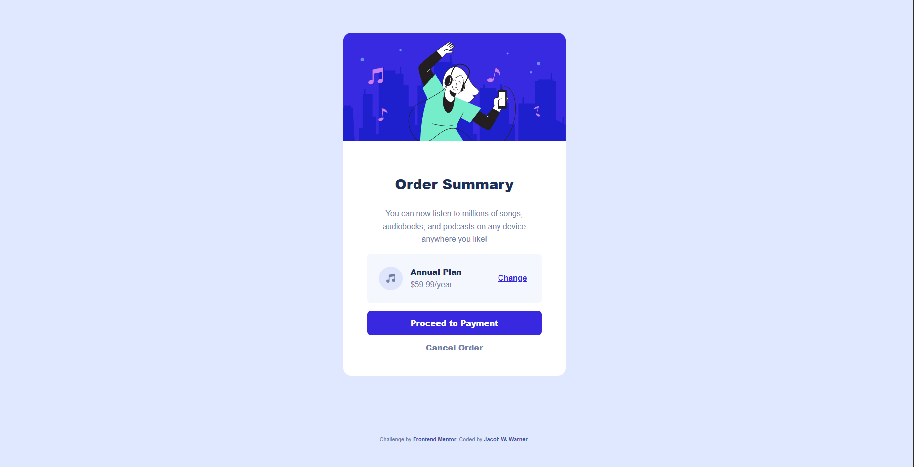

# Frontend Mentor - Order summary card solution

This is a solution to the [Order summary card challenge on Frontend Mentor](https://www.frontendmentor.io/challenges/order-summary-component-QlPmajDUj). Frontend Mentor challenges help you improve your coding skills by building realistic projects. 

## Table of contents

- [Overview](#overview)
  - [The challenge](#the-challenge)
  - [Screenshot](#screenshot)
  - [Links](#links)
- [My process](#my-process)
  - [Built with](#built-with)
  - [What I learned](#what-i-learned)
  - [Useful resources](#useful-resources)
- [Author](#author)
- [Acknowledgments](#acknowledgments)

## Overview

### The challenge

Users should be able to:

- See hover states for interactive elements

### Screenshot




### Links

- Solution URL: (https://www.frontendmentor.io/solutions/order-summary-component-using-cube-css-methodology-94B5K_jcGx)
- Live Site URL: (https://jacobwwarner-order-summary-component.netlify.app/)

## My process

### Built with

- Semantic HTML5 markup
- CSS custom properties
- Flexbox
- CSS Grid
- Mobile-first workflow
- [CUBE CSS Methodology](https://cube.fyi/)

### What I learned

So, the CUBE CSS methodology uses data attributes on HTML elements rather than modifier classes in BEM.
In BEM, you could potentially apply "button-primary" and "button-naked" to the same HTML element causing conflicts in which styles are applied.
CUBE CSS using data attributes limits it to only accepting a single value. Interesting little difference.

```html
<button class="button" data-type="primary">Proceed to Payment</button>
<button class="button" data-type="naked">Cancel Order</button>
```
```css
.button {
    background: transparent;
    font-weight: var(--fw-900);
    text-decoration: none;
    padding: 1em 2em;
    border: 0;
    border-radius: 0.5rem;
    cursor: pointer;
}

/* Using data attribute prevents applying two different style class to the different buttons... */
.button[data-type="primary"] {
    background: var(--clr-primary-400);
    color: var(--clr-neutral-100);
}

.button[data-type="primary"]:hover,
.button[data-type="primary"]:focus {
    background: var(--clr-primary-300);
}

.button[data-type="naked"] {
    color: var(--clr-neutral-400);
    padding: 0;
}

.button[data-type="naked"]:hover,
.button[data-type="naked"]:focus {
    color: var(--clr-neutral-800);
    font-weight: var(--fw-900);
}

```

If you want more help with writing markdown, we'd recommend checking out [The Markdown Guide](https://www.markdownguide.org/) to learn more.

### Continuing Development

- Need to add shadow below primary button.

### Useful resources

- [CUBE CSS Project Docs](https://cube.fyi/)
- [CUBE CSS by Andy Bell](https://piccalil.li/blog/cube-css/)
- [A (more) Modern CSS Reset](https://piccalil.li/blog/a-more-modern-css-reset/)

## Author

- Website - [Jacob W. Warner](https://www.jacobwwarner.com)
- LinkedIn - [@jacobwwarner](https://www.linkedin.com/in/jacobwwarner)
- Frontend Mentor - [@yourusername](https://www.frontendmentor.io/profile/jacobwwarner)
- Twitter - [@yourusername](https://www.twitter.com/jacobwwarner)

## Acknowledgments

- ["A look at the CUBE CSS methodology in action" by Kevin Powell](https://youtu.be/NanhQvnvbR8?si=hkOUpizSYGsdr9YJ)

